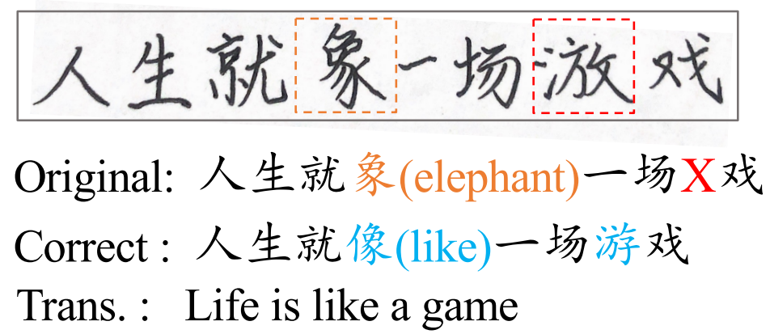

# Visual-C3


## Task Introduction

In the real world where handwriting occupies the vast majority, characters that humans get wrong include faked characters (i.e., untrue characters created due to writing errors) and misspelled characters (i.e., true characters used incorrectly due to spelling errors), as illustrated in Figure 1. **Visual Chinese Character Checking task** aims at detecting and correcting wrong characters in the given text on an image in real-world scenarios. This task focuses on correcting characters based on a human-annotated Visual Chinese Character Checking dataset with faked and misspelled Chinese characters.




## Data Description & Rules

We provide a Chinese Character Checking benchmark named $$Visual-C^{3}$$, a human-annotated Visual Chinese Character Checking dataset with faked and misspelled Chinese character. It consists of 10,072 sentences represented by images. We randomly divided the training set, validation set, and test set according to the ratio of 3:1:1. The validation set can be utilized for model performance testing and hyper-parameter tuning, but it cannot be directly used for model training. 

**Data Description:**

In the Train, Validation and Test folders, three subfolders are included: imgs, label and char_label.

- imgs folder: stores the image dataset.
- label folder: contains the source (src) and target (tgt) labels corresponding to the image dataset, where faked characters in the source labels are represented by the symbol 'X'.
- char_label folder: contains the label of each character in each image in the format of [x_center, y_center, w, h], which represents the center coordinate, width and height of the character respectively.

For model training, only the data provided by [this link](https://cloud.tsinghua.edu.cn/d/2dcf9a4315614a02ad77/) is allowed to be used as supervised data in this shared task. When using these data, please follow the rules set by the original data publisher. Meanwhile, for unsupervised data, any corpus publicly available on the web is allowed to be used. Based on unsupervised data, participants can use any data augmentation methods to construct pseudo-parallel data for model training.

For more information related to this dataset, please refer to our paper: [Towards Real-World Writing Assistance: A Chinese Character Checking Benchmark with Faked and Misspelled Characters](https://arxiv.org/abs/2311.11268). If there are any differences between the paper and this page, the content of this page should prevail.


## Submission & Evaluation

For submission, the following materials should be packaged as one `zip` file and sent to [xzs23@mails.tsinghua.edu.cn](mailto:xzs23@mails.tsinghua.edu.cn):

- Submission File: The output sentences should be written into one text file. **The format of submission file must be the same as the input file. Specifically, the submission file must contain the same number of lines as the input file, and each line is a correct sentence corresponding to the sentence in the input file.** 
- Code: The code folder should contain all the codes of data augmentation, data processing, model training and model inference.
- Document:
  - Data Description: The document needs to contain a brief description of supervised and unsupervised data used in the experiment, as well as the data augmentation methods for unsupervised data.
  - Sharing Link of Unsupervised Data: Unsupervised data used in the experiment should be uploaded to a cloud storage, i.e., net disk, and the sharing link should be included in the document. It is not allowed to use data that violates the rules during model training.


**For evaluation**, we employ both char-based metrics and sentence-based span-level metrics. We provide `eval.py` to compute Precision, Recall and $\text{F}_{0.5}$ between the output sentence and gold edits.


## Contact & Citation

If your publication employs our dataset, please cite the following article:

```
@article{li2023towards,
  title={Towards real-world writing assistance: A chinese character checking benchmark with faked and misspelled characters},
  author={Li, Yinghui and Xu, Zishan and Chen, Shaoshen and Huang, Haojing and Li, Yangning and Jiang, Yong and Li, Zhongli and Zhou, Qingyu and Zheng, Hai-Tao and Shen, Ying},
  journal={arXiv preprint arXiv:2311.11268},
  year={2023}
}
```

If you have any questions about this task, please email to [(xzs23@mails.tsinghua.edu.cn](mailto:xzs23@mails.tsinghua.edu.cn) (C.C. [liyinghu20@mails.tsinghua.edu.cn](mailto:liyinghu20@mails.tsinghua.edu.cn), [zheng.haitao@sz.tsinghua.edu.cn](mailto:zheng.haitao@sz.tsinghua.edu.cn)).